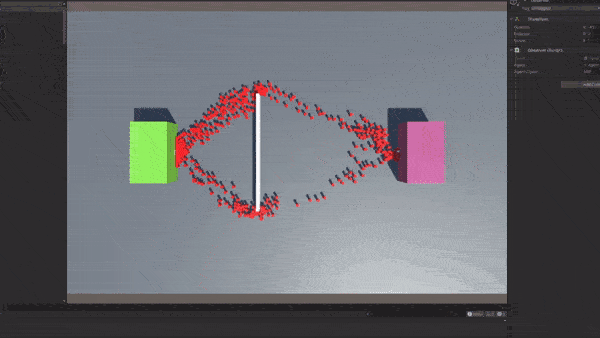

# Evolution-of-particle-systems

We try to simulate large crowds of people in urban environments.
## Table of Contents

* [Project Description](#project-description)
* [Meeting notes 11.05.2021](#meeting-notes-11.05.2021)
* [Technologies](#technologies)
* [TODO](#TODO)
* [Project Status](#project-status)
* [Inspiration](#inspiration)
* [Resources](#resources)
* [Contributors](#contributors)

## Project Description
In this project we want to simulate a big urban enviroment. 

## Meeting notes 11.05.2021 (German)
* Chemotaxis für Ameisen (Alle laufen in Richtung des höchsten Gradienten -> Weg des geringsten Widerstandes)
* Simulation: Simulationstechniken
* Multiagentensysteme
* Anwendungen: Straßennetz passt am ehesten
* Kleine Stadt bauen per Zufallsgenerator und dann entwickeln sich Wege (Patrick Henning),
unterschiedliche Größen mit Eingängen und dann einfach mal simulieren lassen. Verschiedene
Populationen, Anzahl, Interessen etc.
* Brainstorming machen und dann entscheiden wie wir weiter machen
* Erst danach konkrete Pläne
* Open Street Maps für Lagepläne
* Wie dicht muss ich Knoten auf die Fläche packe, wenn man alle Bewegungen erlaubt
* Das nächste Mal mit Demo

## Technologies 
* Unity Version 2020.3.12f1

## TODO
* Look in the [Projects tab](https://github.com/JanMStraub/Evolution-of-particle-systems/projects/3).

## Project Status

### 23.06.2021
Finished first commute routine test with 500 agents.

- - - - -

### 10.07.2021
Finished prototype simulation and tested it with 700 agents.

- - - - -

### 14.07.2021
Implemented NavMesh spawn randomizer to improve performance.
Also tried to deaktivate collision detection, but that caused other problems.

## Inspiration

* [Sebastian Lague - Coding Adventure Ant and Slime Simulations](https://www.youtube.com/watch?v=X-iSQQgOd1A&t)

## Resources

## Contributors

* Paavo Streibich, paavo.streibich@uni-heidelberg.de

* Jan Straub, jan.straub@stud.uni-heidelberg.de